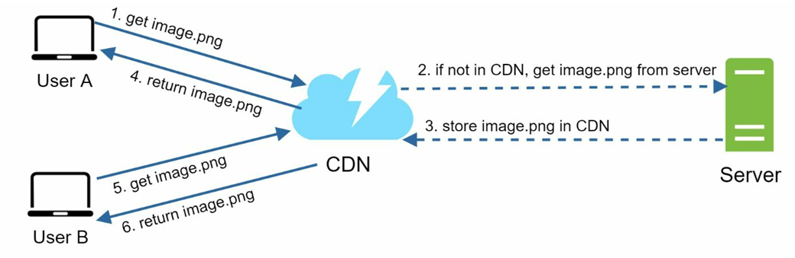
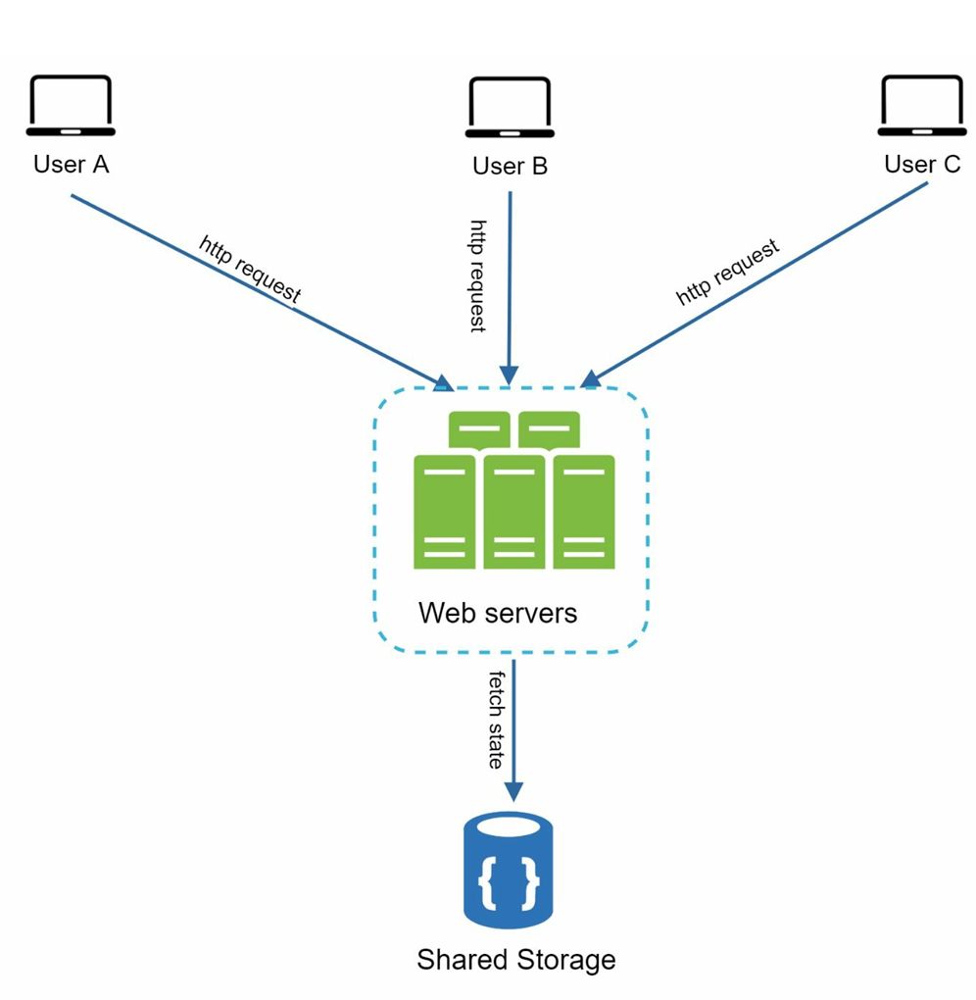
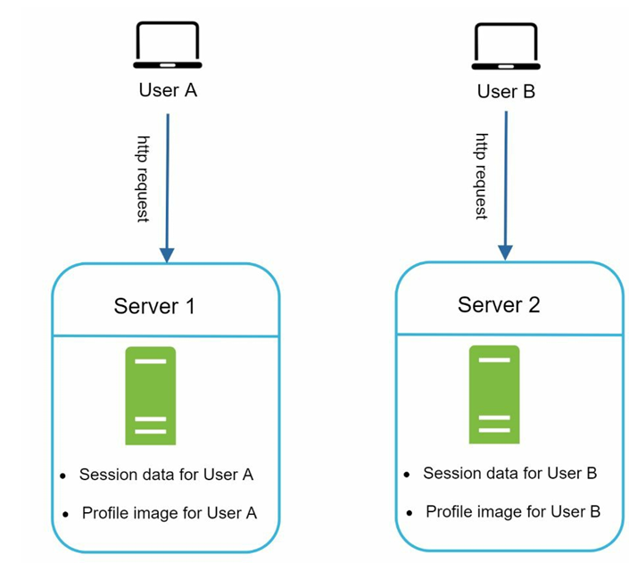
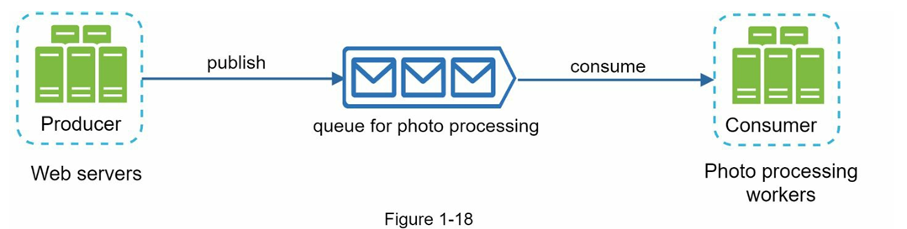

Chapter 1: Scale From Zero to Millions of Users

Cache
A cache is a temporary storage area that stores the result of expensive responses or frequently accessed data in memory, so that subsequent requests are served more quickly.

Considerations:
Cache when data is read frequently but modified infrequently.

Cache data is volatile and not persisted.

Set an expiration policy:

Not too frequent (causes unnecessary updates).

Not too long (can lead to stale data).

Eviction policy:

When full, the cache removes entries based on strategies like LRU (Least Recently Used) or LFU (Least Frequently Used).

Mitigating failures:

Use over-provisioned memory or multiple cache servers across regions to avoid a single point of failure.

Content Delivery Network (CDN)

  

A CDN is a geographically distributed network of servers used to deliver static content (e.g., images, videos, CSS, JS files).

How It Works:

When a user requests an asset:

If present in CDN → served directly (faster).

If not → fetched from the origin server, cached in CDN with a TTL (time-to-live), and returned.

Other users requesting the same asset get it from the CDN (if TTL not expired).

Considerations:

Cost: CDNs are provided by third parties and charge based on data transfers.

Cache expiry:

Too long → stale data.

Too short → increased origin fetches.

CDN fallback:

Ensure data can still be fetched from the server if CDN fails.

Stateless Web Tier

  

In a stateless architecture, session data is stored in persistent storage (like a relational DB or NoSQL DB), not on web servers.

Benefits:
Requests can be routed to any web server.

Scales better and handles server failures more easily.

Shared storage examples: Redis, Memcached, NoSQL DB.

Stateful Architecture

  

In a stateful architecture, client session data is stored on the specific server handling the request.

Drawbacks:
Requests must be routed to the same server (sticky sessions).

Hard to scale dynamically.

Hard to handle failures or add/remove servers efficiently.

Data Centers
Deploying applications in multiple data centers increases availability and fault tolerance.

Routing:
Use GeoDNS to redirect traffic to the nearest data center.

Considerations:
Failover handling: If one data center fails, another can handle 100% of the traffic.

Traffic redirection: Tools are required to effectively reroute.

Data synchronization: Replicate data across regions to prevent inconsistencies.

Test and deployment: Need consistency across data centers.

Message Queue (MQ)

  

A message queue decouples producers and consumers.

How It Works:
Producers generate messages and push them to the queue.

Consumers read and process messages from the queue.

Benefits:
Systems remain responsive even if one component is slow or unavailable.

Scalability: Producers and consumers can be scaled independently.

Database Scaling
1. Vertical Scaling
Add more resources (CPU, RAM) to a single machine.

Limitations: Costly, hardware limitations, single point of failure.

2. Horizontal Scaling (Sharding)
Split the database into shards (logical partitions).

Each shard contains a subset of the data but shares the same schema.

Use a hash function to distribute data to the appropriate shard.

Challenges:
Resharding:

When a shard runs out of space or experiences uneven load.

May require changing the sharding function and redistributing data.

Consistent hashing (covered in Chapter 5) helps here.

Celebrity (Hotspot Key) Problem:

Popular entities (e.g., celebrities) overload a single shard.

Solution: Assign dedicated shards and further partitioning.

Joins & Denormalization:

Joins across shards are hard.

Use denormalization and NoSQL to simplify and reduce load.
