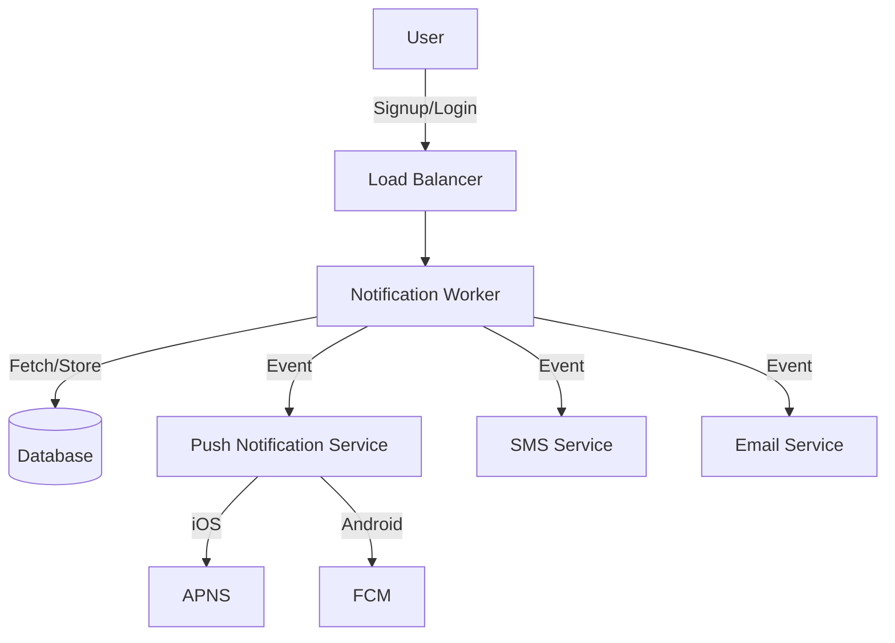

### CHAPTER 10: 📬 Design a Notification System
## 🧩 Overview
The Notification System is designed to send user notifications across multiple channels — **Push Notifications**, **SMS**, and **Emails** — ensuring timely and reliable communication with end users.  
It supports iOS and Android mobile push notifications, transactional SMS, and email notifications, with scalable and asynchronous processing using message queues and worker servers.

---

## ⚙️ Notification Types

| Type | Platform | Providers | Description |
|------|-----------|------------|--------------|
| **Push Notifications** | iOS / Android | **APNS**, **FCM** | Sends push notifications directly to mobile devices. |
| **SMS** | Any | **Twilio**, **Nexmo** | Sends short text messages to users' mobile numbers. |
| **Email** | Any | **Mailchimp**, **SendGrid** | Delivers transactional or marketing emails. |

---

## 🧠 How It Works

### 1. **User Registration & Token Collection**
- When a user signs up or logs in from a mobile app:
  - The app retrieves a **device token** (from APNS for iOS or FCM for Android).
  - The backend stores this token in the **database** for later use.

### 2. **Notification Trigger**
- An event occurs (e.g., appointment scheduled, payment processed, profile updated).
- The event is pushed to the **Notification Queue** for asynchronous handling.

### 3. **Notification Processing**
- The **Notification Worker** fetches jobs from the queue.
- It determines the appropriate channel (Push / SMS / Email).
- It retrieves recipient information from the database.
- Sends the notification via the respective **provider API**.

### 4. **Response Handling**
- Providers respond with success or failure.
- Failures are retried or logged into a **Dead Letter Queue** for further inspection.

---

## 🧱 System Architecture

---

## 🧰 Component Overview

| Component                               | Description                                               |
| --------------------------------------- | --------------------------------------------------------- |
| **Load Balancer**                       | Distributes incoming traffic evenly to available servers. |
| **API Server**                          | Handles sign-up, login, and stores device/contact info.   |
| **Database**                            | Stores users, devices, and notification history.          |
| **Queue (Kafka / RabbitMQ / SQS)**      | Buffers notification jobs for asynchronous processing.    |
| **Notification Worker**                 | Consumes jobs from queue and sends notifications.         |
| **Providers (APNS, FCM, Twilio, etc.)** | External systems that deliver the notifications.          |

---

## 🚀 Scalability & Reliability

Load Balancing: Handles heavy traffic using multiple API servers.

Asynchronous Processing: Uses queues to avoid blocking operations.

Retry Mechanism: Retries failed notifications automatically.

Dead Letter Queue: Stores failed events for debugging or reprocessing.

Horizontal Scaling: Workers can scale based on message volume.

Monitoring: Integration with tools like Prometheus / Grafana for metrics.

---

## 📈 End-to-End Flow Summary

User performs an action that triggers an event.

The event is sent to the notification service via API.

The event is queued for background processing.

The worker fetches the job and determines the channel.

The worker sends the message to the respective provider.

Provider delivers to the device/email/SMS endpoint.

Response is logged and status updated in the database. 

---
## 🧠 System Deep Dive

This section explores the internal mechanisms that ensure **reliability**, **data consistency**, and **observability** of the Notification System. The design guarantees high availability, exactly-once delivery semantics, and fault-tolerant processing across all channels (Push, SMS, and Email).

---

### 🔒 Reliability and Data Integrity

To ensure **no data loss**, all notifications and user device tokens are persisted in durable storage before being queued for delivery.  
- Each notification event is written to a **persistent message queue** (Kafka / RabbitMQ / AWS SQS).  
- Queues act as a **buffer** to decouple the producer (API Server) from the consumer (Notification Worker).  
- Messages are acknowledged (`ACK`) only after successful processing and delivery to external providers.  
- If the worker fails before acknowledging, the message remains in the queue and is reprocessed by another worker.

This design ensures:
- **At-least-once delivery** for all notifications.
- Optional **idempotent processing** at the worker level to simulate **exactly-once delivery** by using unique notification IDs.

---

### 📦 Exactly-Once Delivery Semantics

To avoid sending duplicate notifications:
- Each notification has a **unique message ID** generated at creation.  
- Before sending, the worker checks whether a notification with the same ID already exists in the database.  
- If found, it’s skipped to prevent duplication.  
- Idempotent endpoints or **deduplication keys** (using Redis or Kafka message keys) further enforce this guarantee.

This allows recipients to **receive exactly one notification** even if retries or failovers occur.

---

### 🧾 Notification Template Management

Templates ensure consistent and branded communication across channels.

- Templates are stored in a **Template Repository** (DB or S3 bucket) with placeholders for dynamic values.  
- Examples:  
  - `{{username}}`, `{{appointment_date}}`, `{{doctor_name}}`  
- The **Notification Worker** fetches and renders templates at runtime using a templating engine (e.g., Handlebars, Mustache, or Thymeleaf).  
- Each template version is **version-controlled**, allowing rollback to previous message formats when needed.

---

### 🚦 Rate Limiting & Throttling

To prevent overloading external providers and avoid user spam:
- Implement **per-user**, **per-channel**, and **per-provider** rate limits.
- Rate-limiting strategies include:
  - **Token Bucket Algorithm:** Limits the number of notifications per user per time window.
  - **Provider-based Throttling:** Caps requests sent to APNS/FCM/Twilio per second.
- Excess messages are queued and released gradually using **backpressure control**.
- Rate metrics are stored and monitored in Redis or a distributed cache for high-speed access.

---

### 🔁 Retry Mechanism

Failed notification deliveries (due to transient errors like network timeout or provider unavailability) are retried intelligently.

#### **Retry Logic:**
- Retries follow an **exponential backoff** strategy with jitter (e.g., 1s, 2s, 4s, 8s, ...).
- Max retry count is configurable (e.g., 3–5 attempts).
- Permanent failures (e.g., invalid device token) are marked as **“Dead Letter”** and sent to a **Dead-Letter Queue (DLQ)** for later analysis.

#### **Benefits:**
- Ensures transient failures don’t result in data loss.
- Prevents infinite retry loops and provider rate violations.

---

### 📊 Monitoring & Observability

All notifications are tracked and logged through an **Event Tracking System** for operational visibility and debugging.

| Metric | Description |
|--------|--------------|
| **Queued Count** | Number of notifications waiting in the queue. |
| **Delivered Count** | Total successfully sent notifications. |
| **Failed Count** | Notifications that failed and entered DLQ. |
| **Average Latency** | Time taken from event trigger to delivery. |
| **Retry Attempts** | Number of retries per notification. |

Monitoring tools:
- **Prometheus / Grafana:** Real-time dashboards and alerts.  
- **ELK Stack (Elasticsearch, Logstash, Kibana):** Log aggregation and error tracing.  
- **AWS CloudWatch / Datadog:** Queue depth and latency monitoring.  

Alerts trigger when:
- Queue depth exceeds threshold.
- Failure rate surpasses a set percentage.
- Delivery latency crosses SLA.

---

### 🛰️ Event Tracking and Auditing

Every stage of the notification lifecycle is recorded for traceability.

**Event Stages:**
1. `Created` – Notification generated and queued.  
2. `Processing` – Worker fetched and began processing.  
3. `Sent` – Successfully sent to provider.  
4. `Delivered` – Provider confirmed delivery (if supported).  
5. `Failed` – Permanent or transient failure occurred.  

Logs include:
- User ID  
- Notification type  
- Provider response  
- Timestamps for each stage  

These logs enable:
- End-to-end tracing for debugging.
- Delivery analytics (e.g., success rate, delivery time).
- Auditable event history for compliance (HIPAA, GDPR, etc.).

---

### 🧮 Monitoring Queued Notifications

Queued notifications are continuously monitored to prevent overflow:
- **Queue length metrics** are collected periodically.  
- **Alert thresholds** are defined (e.g., >10,000 pending = alert).  
- **Automatic scaling** of workers occurs when the queue backlog increases, using the Kubernetes Horizontal Pod Autoscaler (HPA).

This ensures timely delivery during traffic spikes.

---

### ✅ Deep Dive - Summary

| Feature | Reliability Benefit |
|----------|---------------------|
| **Persistent Queue (Kafka/SQS)** | Guarantees no data loss during processing. |
| **Idempotent Workers** | Prevents duplicate deliveries (exactly-once effect). |
| **Exponential Backoff Retries** | Handles transient errors gracefully. |
| **Dead-Letter Queue** | Captures irrecoverable failures for analysis. |
| **Rate Limiting** | Protects system and providers from overload. |
| **Template Engine** | Ensures consistent, personalized content. |
| **Monitoring & Alerts** | Enables real-time visibility into delivery pipelines. |

---

## 📚 Summary

This Notification System is a scalable, fault-tolerant, and modular architecture for sending notifications across multiple platforms.
It ensures that all communication channels (Push, SMS, Email) are handled in a unified, asynchronous, and efficient manner.
