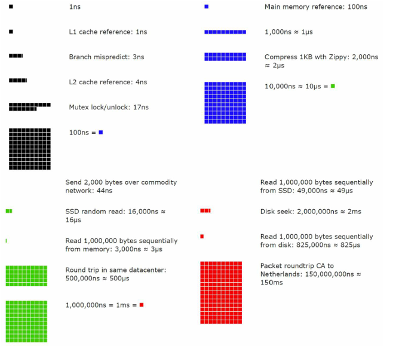

📘 Chapter 2: Back-of-the-Envelope Estimation
To design scalable systems effectively, it's essential to develop an intuition for common values and performance characteristics. This chapter introduces foundational numbers that help in making quick estimations and trade-offs during system design.

🔢 Power of Two
Understanding data volumes in powers of 2 is fundamental in computer systems:

1 Byte = 8 bits

1 KB = 2¹⁰ Bytes = 1,024 Bytes

1 MB = 2²⁰ Bytes = 1,048,576 Bytes

1 GB = 2³⁰ Bytes = 1,073,741,824 Bytes

1 TB = 2⁴⁰ Bytes = 1,099,511,627,776 Bytes

⚡ Latency Numbers (Rough Estimates)
Latency is the time taken to perform operations such as accessing data. Here's a general sense of how long common operations take:

Operation	Time Taken (approx.)
L1 Cache Access	~0.5 ns
L2 Cache Access	~7 ns
Main Memory Access (RAM)	~100 ns
SSD Disk I/O	~100 µs
Rotational Disk I/O	~1-10 ms
Network (within data center)	~0.5 ms
Network (cross data center/region)	~50-150 ms

Key Takeaways:

Memory access is much faster than disk access.

Disk seeks are expensive—avoid them where possible.

Compressing data before transmission reduces latency and bandwidth usage.

Data transfer across data centers introduces significant delay; plan accordingly.

🟢 Availability Numbers (The “Nines”)
Availability indicates the percentage of time a system is operational. Here’s what the common "9's" mean in real-world downtime:

Availability	Downtime per Year	Downtime per Day
99%	3.65 days	14.4 mins
99.9%	8.76 hours	1.44 mins
99.99%	52.56 mins	8.64 secs
99.999%	5.26 mins	0.864 secs

Note:
Service providers often commit to "four nines" (99.99%), meaning up to ~52.5 minutes of downtime annually.

Rule of thumb: The more 9's, the better the uptime, but it often comes with higher costs and complexity.
