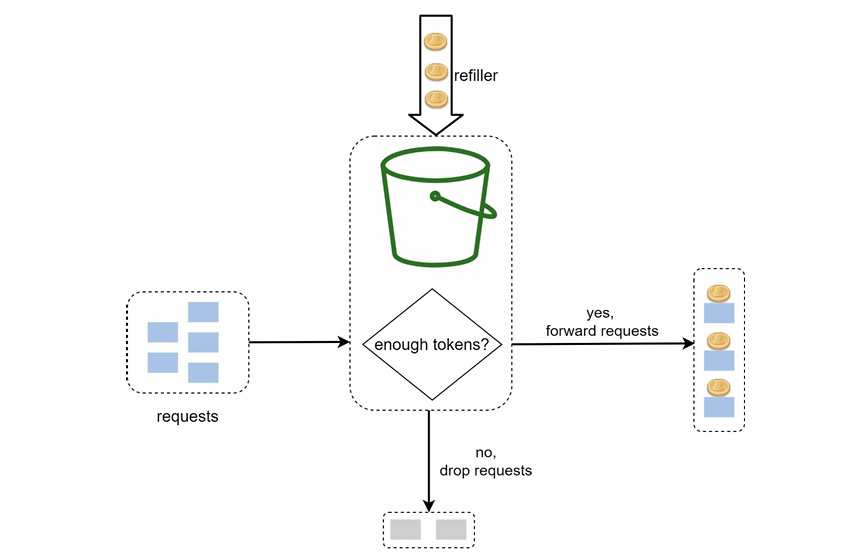
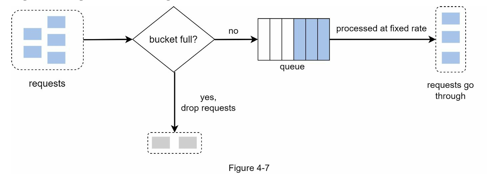
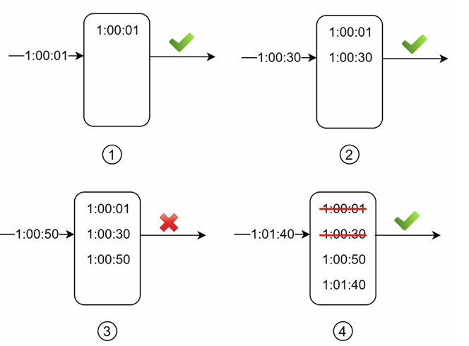

A rate limiter is a system component that restricts the number of client requests allowed within a specified time window. Any request exceeding the allowed threshold is blocked or throttled.

Rate limiting is crucial in large-scale systems to:

✅ Prevent resource starvation and protect APIs from Denial of Service (DoS) attacks.

✅ Reduce infrastructure costs by controlling unnecessary or excessive traffic.

✅ Optimize third-party API usage, especially when billed per request.

✅ Prevent server overloads caused by bots or malicious actors.

✅ Ensure fair usage among all users of a system.

🧠 Step 1: Understand the Problem and Define Scope

Ask the following key design questions:

Do we need client-side or server-side rate limiting?

What is the expected number of users and request volume?

How should throttled users be informed (e.g., HTTP 429 status)?

Is the system distributed? Should the rate limiter be a shared service?

Should rate limits vary by API, by user/IP, or globally?

🏗️ Step 2: High-Level Design

📍 Where to Place the Rate Limiter
Client-Side Rate Limiting:
Generally not recommended. Clients can be tampered with or forged. Malicious users may bypass these limits.

Server-Side Rate Limiting (API Layer):
Most common and secure. Rate limiting logic is implemented at the API server or via middleware.

Middleware or Gateway-Based Rate Limiting:
Effective in microservice or distributed environments. This allows centralized enforcement before traffic reaches internal services.

🔁 Step 3: Choose a Rate Limiting Algorithm

Different algorithms offer trade-offs in accuracy, memory, and performance:

| **Algorithm**              | **Description**                                                         | **Use Case**                      |
| -------------------------- | ----------------------------------------------------------------------- | --------------------------------- |
| **Token Bucket**           | Allows bursts; tokens are added periodically and consumed per request   | Most flexible, real-time APIs     |
| **Leaky Bucket**           | Requests processed at a constant rate; overflow is discarded or delayed | Smooth, consistent rate control   |
| **Fixed Window Counter**   | Counts requests in fixed intervals (e.g., 1 min)                        | Simple, fast, but prone to spikes |
| **Sliding Window Log**     | Logs each request with timestamps; checks against a rolling window      | Accurate but memory intensive     |
| **Sliding Window Counter** | Hybrid of fixed window + averaging over sliding time                    | More accurate than fixed window   |

💧 Token Bucket Algorithm

The Token Bucket algorithm is commonly used due to its flexibility and efficiency.

A bucket with a fixed capacity holds "tokens".

Tokens are added at a regular interval (refill rate).

Each request consumes one token.

If a request arrives and no tokens are available, it is rejected or delayed.

Allows bursts as long as tokens are available, but enforces a steady rate long-term.

⛽ Use Case Consideration
Decide how many buckets are needed based on use cases:

Example: If a system must allow 5 friend requests/day and 10 messages/minute, use two separate buckets — one per rule.

✅ Pros

Simple to Implement: Straightforward logic, widely supported in libraries and frameworks.

Memory Efficient: Requires only counters and a timestamp for refill logic.

Supports Bursts: Unlike Leaky Bucket, it allows occasional high-traffic bursts.

Flexible Configuration: Adjustable bucket size and refill rate enable fine-tuned control.

Real-Time Enforcement: Immediate decision on whether to accept or reject a request.

❌ Cons

Tuning Complexity: Choosing the right refill rate and bucket size depends on expected traffic, making configuration tricky.

Time Synchronization: In distributed systems, maintaining accurate time or using centralized storage (e.g., Redis) adds complexity.

Not Ideal for Hard Limits: If exact request limits per interval are needed, sliding window counters may offer stricter enforcement.

💧 Leaky Bucket Algorithm

The Leaky Bucket (LB) algorithm is similar to the Token Bucket but processes requests at a fixed rate, making it ideal for steady throughput systems. It is typically implemented using a FIFO queue.

🛠️ How it Works:
Each incoming request is placed in a fixed-size queue.

If the queue is not full, the request is added.

If the queue is full, the request is dropped.

Requests are processed at a constant rate (outflow rate), regardless of burst traffic.

⚙️ Parameters:

Bucket size – Maximum number of requests the queue can hold.

Outflow rate – Rate at which requests are processed.

✅ Pros:
    
    Memory efficient due to limited queue size.
    
    Ensures consistent and smooth processing rate, good for stable systems.

❌ Cons:

    A traffic burst can fill the queue with older requests, potentially starving newer ones.
    
    Like Token Bucket, choosing the right size and rate can be tricky.

📏 Fixed Window Counter Algorithm

This algorithm uses a fixed time window (e.g., 1 minute) and counts requests within that window. If the request count exceeds a set threshold, further requests are blocked until the window resets.

🛠️ How it Works:
    
    Define a fixed interval (e.g., 1 minute).
    
    Count the number of requests during that interval.
    
    Reject any request exceeding the threshold until the next window starts.

✅ Pros:

Very memory efficient.

    Simple to implement and understand.
    
    Ideal for use cases where quota resets at fixed time intervals are acceptable.

❌ Cons:

    Vulnerable to spikes at window edges (e.g., burst at 59s and again at 0s).
    
    May allow more requests than the defined threshold in short bursts.

⏱️ Sliding Window Log Algorithm
This algorithm improves upon Fixed Window Counter by tracking exact timestamps of requests. It ensures a rolling rate limit is enforced more accurately.

🛠️ How it Works:
Store a log of timestamps (commonly in a Redis sorted set).

For each new request:

Remove expired timestamps.

Check how many timestamps are within the rolling window.

Accept or reject based on this count.

✅ Pros:

    Highly accurate — ensures no window exceeds the limit.
    
    Solves the spike issue present in Fixed Window Counter.

❌ Cons:

    Memory-intensive — stores every timestamp, even for rejected requests.
    
    May be costly at scale without optimization.

⚖️ Sliding Window Counter Algorithm

A hybrid approach that combines Fixed Window Counter and Sliding Window Log. It estimates the request count using the current and previous time windows for a smoother rate limiting effect.

🛠️ How it Works:
Request Count =
requests in current window +
requests in previous window * overlap percentage.

✅ Pros:
Reduces spikes — averages traffic over sliding windows.

More memory efficient than sliding log.

❌ Cons:
Approximate rather than exact.

Assumes even distribution of past requests, which may not always hold.

However, in practice (e.g., Cloudflare tests), inaccuracy is negligible (~0.003% errors over 400M requests).

🏗️ High-Level Architecture Overview

To implement rate limiting effectively:

Maintain a counter per user/IP/API key.

For each incoming request:

If the counter exceeds the defined limit, reject the request.

Otherwise, increment the counter and allow the request.

🧠 Where to Store the Counter?

Disk-based storage is slow and not ideal for real-time rate limiting.

In-memory cache (e.g., Redis) is the preferred solution:

Fast read/write.

Built-in support for TTL (time-to-live) expiration.

